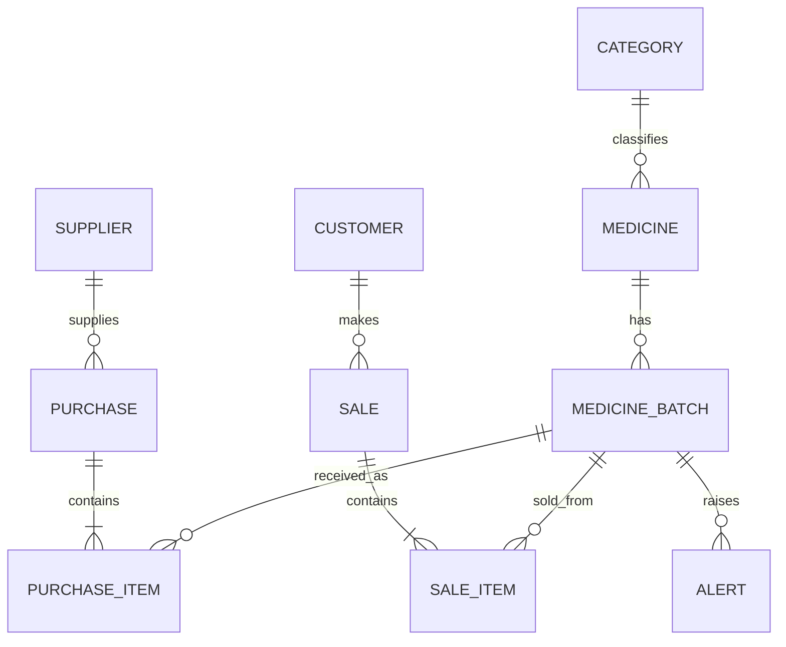

# ER Model

## Simplest explanation
- `MEDICINE` stores product identity.
- `MEDICINE_BATCH` stores expiry date and current quantity because those change per batch.
- `PURCHASE/PURCHASE_ITEM` store purchase history.
- `SALE/SALE_ITEM` store sales history and preserve which batch was sold.
- `ALERT` stores expiry warnings for a batch.
