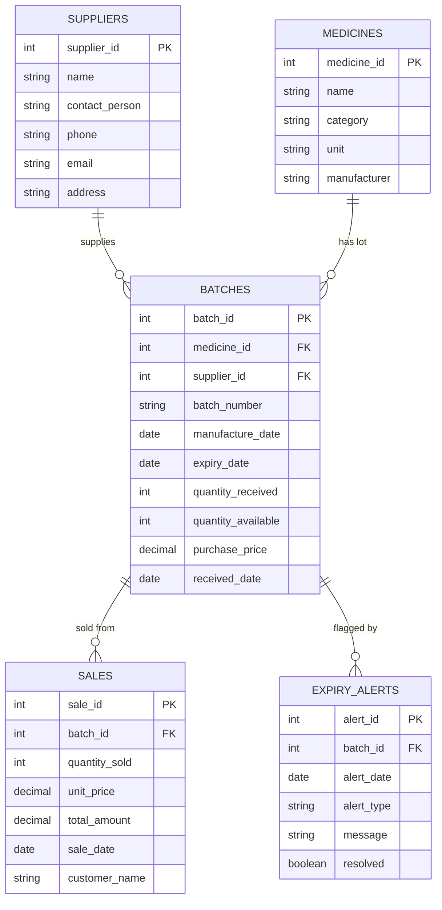

# ER Diagram

## Relationships

- One **supplier** supplies many **batches**.
- One **medicine** has many **batches** (each restock is a distinct batch with its own expiry).
- One **batch** can be sold across many **sales** rows (partial sales over time).
- One **batch** can generate many **expiry alerts** (e.g. 90/30/7-day warnings).

## Design notes

- `Batches.quantity_available` is derived/maintained via trigger on `Sales`
  insert, rather than recomputed from `Sales` each time — trade-off of
  redundancy for read performance, kept consistent by the trigger.
- Expiry status itself is not stored as a column; it's derived from
  `expiry_date` vs `CURRENT_DATE` in views/queries, so it's never stale.
